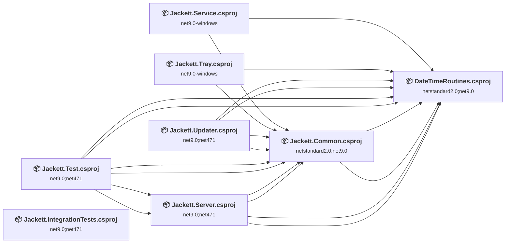
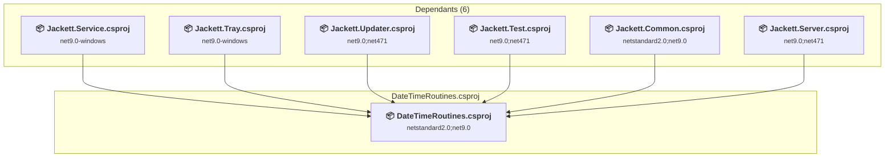
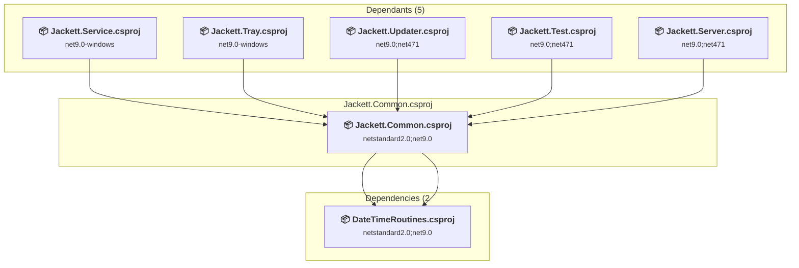
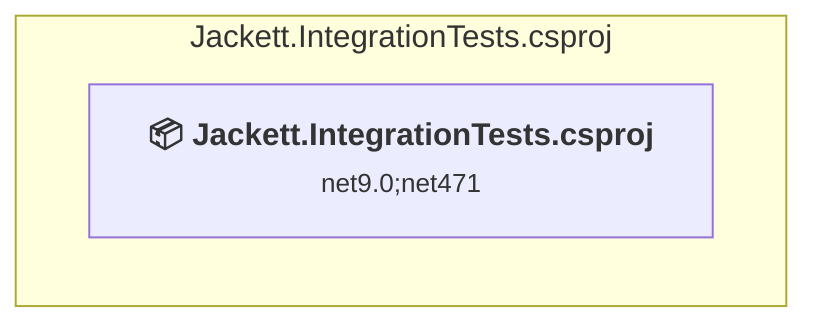
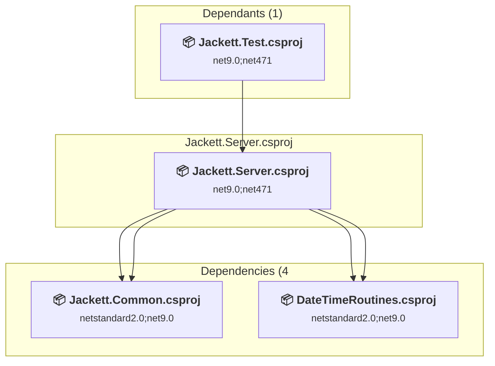
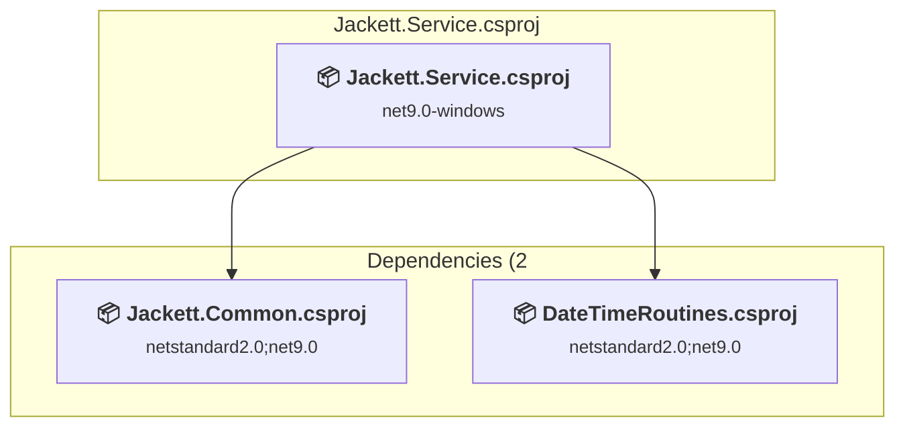
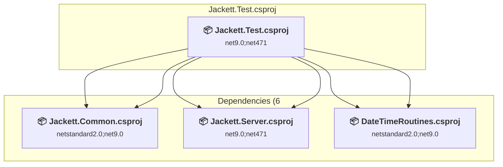
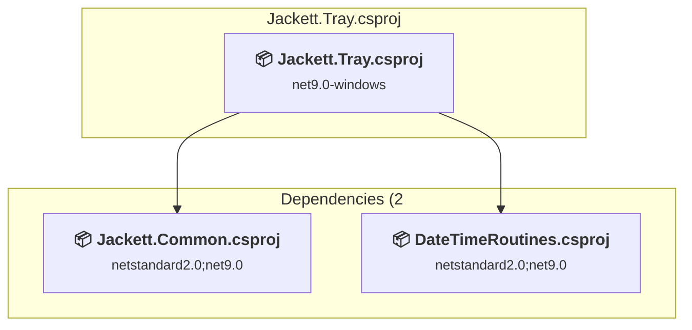
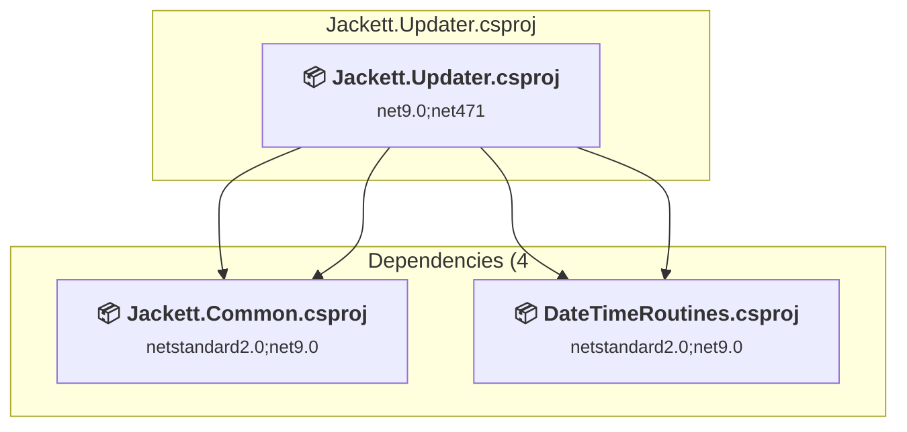

# Projects and dependencies analysis

This document provides a comprehensive overview of the projects and their dependencies in the context of upgrading to .NETCoreApp,Version=v10.0.

## Table of Contents

- [Executive Summary](#executive-Summary)
  - [Highlevel Metrics](#highlevel-metrics)
  - [Projects Compatibility](#projects-compatibility)
  - [Package Compatibility](#package-compatibility)
  - [API Compatibility](#api-compatibility)
  - [Binding Redirect Configuration](#binding-redirect-configuration)
- [Aggregate NuGet packages details](#aggregate-nuget-packages-details)
- [Top API Migration Challenges](#top-api-migration-challenges)
  - [Technologies and Features](#technologies-and-features)
  - [Most Frequent API Issues](#most-frequent-api-issues)
- [Projects Relationship Graph](#projects-relationship-graph)
- [Project Details](#project-details)

  - [DateTimeRoutines\DateTimeRoutines.csproj](#datetimeroutinesdatetimeroutinescsproj)
  - [Jackett.Common\Jackett.Common.csproj](#jackettcommonjackettcommoncsproj)
  - [Jackett.IntegrationTests\Jackett.IntegrationTests.csproj](#jackettintegrationtestsjackettintegrationtestscsproj)
  - [Jackett.Server\Jackett.Server.csproj](#jackettserverjackettservercsproj)
  - [Jackett.Service\Jackett.Service.csproj](#jackettservicejackettservicecsproj)
  - [Jackett.Test\Jackett.Test.csproj](#jacketttestjacketttestcsproj)
  - [Jackett.Tray\Jackett.Tray.csproj](#jacketttrayjacketttraycsproj)
  - [Jackett.Updater\Jackett.Updater.csproj](#jackettupdaterjackettupdatercsproj)

## Executive Summary

### Highlevel Metrics

| Metric | Count | Status |
| :--- | :---: | :--- |
| Total Projects | 8 | All require upgrade |
| Total NuGet Packages | 34 | 5 need upgrade |
| Total Code Files | 7 |  |
| Total Code Files with Incidents | 125 |  |
| Total Lines of Code | 680 |  |
| Total Number of Issues | 1398 |  |
| Estimated LOC to modify | 1381+ | at least 203.1% of codebase |

### Projects Compatibility

| Project | Target Framework | Difficulty | Package Issues | API Issues | Binding Issues | Est. LOC Impact | Description |
| :--- | :---: | :---: | :---: | :---: | :---: | :---: | :--- |
| [DateTimeRoutines\DateTimeRoutines.csproj](#datetimeroutinesdatetimeroutinescsproj) | netstandard2.0;net9.0 | 🟢 Low | 0 | 0 | 0 |  | ClassLibrary, Sdk Style = True |
| [Jackett.Common\Jackett.Common.csproj](#jackettcommonjackettcommoncsproj) | netstandard2.0;net9.0 | 🟢 Low | 5 | 909 | 0 | 909+ | ClassLibrary, Sdk Style = True |
| [Jackett.IntegrationTests\Jackett.IntegrationTests.csproj](#jackettintegrationtestsjackettintegrationtestscsproj) | net9.0;net471 | 🟢 Low | 0 | 5 | 0 | 5+ | ClassLibrary, Sdk Style = True |
| [Jackett.Server\Jackett.Server.csproj](#jackettserverjackettservercsproj) | net9.0;net471 | 🟢 Low | 2 | 121 | 0 | 121+ | AspNetCore, Sdk Style = True |
| [Jackett.Service\Jackett.Service.csproj](#jackettservicejackettservicecsproj) | net9.0-windows | 🟢 Low | 0 | 8 | 0 | 8+ | WinForms, Sdk Style = True |
| [Jackett.Test\Jackett.Test.csproj](#jacketttestjacketttestcsproj) | net9.0;net471 | 🟢 Low | 2 | 51 | 0 | 51+ | ClassLibrary, Sdk Style = True |
| [Jackett.Tray\Jackett.Tray.csproj](#jacketttrayjacketttraycsproj) | net9.0-windows | 🟡 Medium | 0 | 286 | 0 | 286+ | WinForms, Sdk Style = True |
| [Jackett.Updater\Jackett.Updater.csproj](#jackettupdaterjackettupdatercsproj) | net9.0;net471 | 🟢 Low | 0 | 1 | 0 | 1+ | DotNetCoreApp, Sdk Style = True |

### Package Compatibility

| Status | Count | Percentage |
| :--- | :---: | :---: |
| ✅ Compatible | 29 | 85.3% |
| ⚠️ Incompatible | 0 | 0.0% |
| 🔄 Upgrade Recommended | 5 | 14.7% |
| ***Total NuGet Packages*** | ***34*** | ***100%*** |

### API Compatibility

| Category | Count | Impact |
| :--- | :---: | :--- |
| 🔴 Binary Incompatible | 281 | High - Require code changes |
| 🟡 Source Incompatible | 116 | Medium - Needs re-compilation and potential conflicting API error fixing |
| 🔵 Behavioral change | 984 | Low - Behavioral changes that may require testing at runtime |
| ✅ Compatible | 54516 |  |
| ***Total APIs Analyzed*** | ***55897*** |  |

## Aggregate NuGet packages details

| Package | Current Version | Suggested Version | Projects | Description |
| :--- | :---: | :---: | :--- | :--- |
| AngleSharp | 1.4.0 |  | [Jackett.Common.csproj](#jackettcommonjackettcommoncsproj) | ✅Compatible |
| AngleSharp.Xml | 1.0.0 |  | [Jackett.Common.csproj](#jackettcommonjackettcommoncsproj) | ✅Compatible |
| Autofac | 8.0.0 |  | [Jackett.Common.csproj](#jackettcommonjackettcommoncsproj) [Jackett.Server.csproj](#jackettserverjackettservercsproj) [Jackett.Test.csproj](#jacketttestjacketttestcsproj) | ✅Compatible |
| Autofac.Extensions.DependencyInjection | 9.0.0 |  | [Jackett.Server.csproj](#jackettserverjackettservercsproj) | ✅Compatible |
| BencodeNET | 4.0.0 |  | [Jackett.Common.csproj](#jackettcommonjackettcommoncsproj) | ✅Compatible |
| CommandLineParser | 2.9.1 |  | [Jackett.Common.csproj](#jackettcommonjackettcommoncsproj) [Jackett.Server.csproj](#jackettserverjackettservercsproj) [Jackett.Tray.csproj](#jacketttrayjacketttraycsproj) | ✅Compatible |
| coverlet.msbuild | 6.0.4 |  | [Jackett.Test.csproj](#jacketttestjacketttestcsproj) | ✅Compatible |
| DotNet4.SocksProxy | 1.4.0.1 |  | [Jackett.Common.csproj](#jackettcommonjackettcommoncsproj) | ✅Compatible |
| FlareSolverrSharp | 3.0.7 |  | [Jackett.Common.csproj](#jackettcommonjackettcommoncsproj) | ✅Compatible |
| FluentAssertions | 6.12.1 |  | [Jackett.Test.csproj](#jacketttestjacketttestcsproj) | ✅Compatible |
| Microsoft.AspNetCore.DataProtection | 9.0.16 | 10.0.9 | [Jackett.Test.csproj](#jacketttestjacketttestcsproj) | NuGet package upgrade is recommended |
| Microsoft.AspNetCore.Http | 2.3.9 |  | [Jackett.Common.csproj](#jackettcommonjackettcommoncsproj) | ✅Compatible |
| Microsoft.AspNetCore.WebUtilities | 2.3.9 | 10.0.9 | [Jackett.Common.csproj](#jackettcommonjackettcommoncsproj) | NuGet package upgrade is recommended |
| Microsoft.CSharp | 4.7.0 |  | [Jackett.Common.csproj](#jackettcommonjackettcommoncsproj) | ✅Compatible |
| Microsoft.NET.Test.Sdk | 17.14.1 |  | [Jackett.IntegrationTests.csproj](#jackettintegrationtestsjackettintegrationtestscsproj) [Jackett.Test.csproj](#jacketttestjacketttestcsproj) | ✅Compatible |
| MimeMapping | 1.0.1.50 |  | [Jackett.Common.csproj](#jackettcommonjackettcommoncsproj) | ✅Compatible |
| Mono.Posix | 7.1.0-final.1.21458.1 |  | [Jackett.Server.csproj](#jackettserverjackettservercsproj) | ✅Compatible |
| MSTest.TestAdapter | 3.10.4 |  | [Jackett.IntegrationTests.csproj](#jackettintegrationtestsjackettintegrationtestscsproj) [Jackett.Test.csproj](#jacketttestjacketttestcsproj) | ✅Compatible |
| MSTest.TestFramework | 3.10.4 |  | [Jackett.IntegrationTests.csproj](#jackettintegrationtestsjackettintegrationtestscsproj) [Jackett.Test.csproj](#jacketttestjacketttestcsproj) | ✅Compatible |
| Newtonsoft.Json | 13.0.4 |  | [Jackett.Common.csproj](#jackettcommonjackettcommoncsproj) | ✅Compatible |
| NLog | 5.5.1 |  | [Jackett.Common.csproj](#jackettcommonjackettcommoncsproj) [Jackett.Server.csproj](#jackettserverjackettservercsproj) | ✅Compatible |
| NLog.Web.AspNetCore | 5.5.0 |  | [Jackett.Server.csproj](#jackettserverjackettservercsproj) | ✅Compatible |
| NUnit | 3.14.0 |  | [Jackett.Test.csproj](#jacketttestjacketttestcsproj) | ✅Compatible |
| NUnit.ConsoleRunner | 3.17.0 |  | [Jackett.Test.csproj](#jacketttestjacketttestcsproj) | ✅Compatible |
| NUnit3TestAdapter | 4.5.0 |  | [Jackett.Test.csproj](#jacketttestjacketttestcsproj) | ✅Compatible |
| Polly | 8.6.6 |  | [Jackett.Common.csproj](#jackettcommonjackettcommoncsproj) | ✅Compatible |
| Selenium.Chrome.WebDriver | 85.0.0 |  | [Jackett.IntegrationTests.csproj](#jackettintegrationtestsjackettintegrationtestscsproj) | ✅Compatible |
| Selenium.WebDriver | 4.35.0 |  | [Jackett.IntegrationTests.csproj](#jackettintegrationtestsjackettintegrationtestscsproj) | ✅Compatible |
| SharpZipLib | 1.4.2 |  | [Jackett.Common.csproj](#jackettcommonjackettcommoncsproj) | ✅Compatible |
| System.IO.FileSystem.AccessControl | 5.0.0 |  | [Jackett.Common.csproj](#jackettcommonjackettcommoncsproj) | NuGet package functionality is included with framework reference |
| System.ServiceProcess.ServiceController | 9.0.16 | 10.0.9 | [Jackett.Common.csproj](#jackettcommonjackettcommoncsproj) [Jackett.Server.csproj](#jackettserverjackettservercsproj) | NuGet package upgrade is recommended |
| System.Text.Encoding.CodePages | 9.0.16 | 10.0.9 | [Jackett.Common.csproj](#jackettcommonjackettcommoncsproj) [Jackett.Server.csproj](#jackettserverjackettservercsproj) [Jackett.Test.csproj](#jacketttestjacketttestcsproj) | NuGet package upgrade is recommended |
| System.Text.Json | 9.0.16 | 10.0.9 | [Jackett.Common.csproj](#jackettcommonjackettcommoncsproj) | NuGet package upgrade is recommended |
| YamlDotNet | 16.3.0 |  | [Jackett.Common.csproj](#jackettcommonjackettcommoncsproj) | ✅Compatible |

## Top API Migration Challenges

### Technologies and Features

| Technology | Issues | Percentage | Migration Path |
| :--- | :---: | :---: | :--- |
| Windows Forms | 281 | 20.3% | Windows Forms APIs for building Windows desktop applications with traditional Forms-based UI that are available in .NET on Windows. Enable Windows Desktop support: Option 1 (Recommended): Target net9.0-windows; Option 2: Add <UseWindowsDesktop>true</UseWindowsDesktop>; Option 3 (Legacy): Use Microsoft.NET.Sdk.WindowsDesktop SDK. |
| GDI+ / System.Drawing | 3 | 0.2% | System.Drawing APIs for 2D graphics, imaging, and printing that are available via NuGet package System.Drawing.Common. Note: Not recommended for server scenarios due to Windows dependencies; consider cross-platform alternatives like SkiaSharp or ImageSharp for new code. |
| Windows Forms Legacy Controls | 1 | 0.1% | Legacy Windows Forms controls that have been removed from .NET Core/5+ including StatusBar, DataGrid, ContextMenu, MainMenu, MenuItem, and ToolBar. These controls were replaced by more modern alternatives. Use ToolStrip, MenuStrip, ContextMenuStrip, and DataGridView instead. |

### Most Frequent API Issues

| API | Count | Percentage | Category |
| :--- | :---: | :---: | :--- |
| T:System.Uri | 721 | 52.2% | Behavioral Change |
| M:System.Uri.#ctor(System.String) | 176 | 12.7% | Behavioral Change |
| T:System.Windows.Forms.ToolStripMenuItem | 62 | 4.5% | Binary Incompatible |
| P:System.Uri.AbsoluteUri | 27 | 2.0% | Behavioral Change |
| T:System.ServiceProcess.ServiceControllerStatus | 22 | 1.6% | Source Incompatible |
| P:System.Environment.OSVersion | 19 | 1.4% | Behavioral Change |
| T:System.Windows.Forms.NotifyIcon | 19 | 1.4% | Binary Incompatible |
| T:System.ServiceProcess.ServiceController | 16 | 1.2% | Source Incompatible |
| T:System.Windows.Forms.ToolStripSeparator | 16 | 1.2% | Binary Incompatible |
| T:System.Windows.Forms.ContextMenuStrip | 11 | 0.8% | Binary Incompatible |
| P:System.Windows.Forms.ToolStripItem.Text | 11 | 0.8% | Binary Incompatible |
| P:System.Windows.Forms.ToolStripItem.Visible | 11 | 0.8% | Binary Incompatible |
| M:System.TimeSpan.FromSeconds(System.Double) | 10 | 0.7% | Source Incompatible |
| T:System.Net.Http.HttpContent | 10 | 0.7% | Behavioral Change |
| M:System.Uri.TryCreate(System.String,System.UriKind,System.Uri@) | 10 | 0.7% | Behavioral Change |
| T:System.Windows.Forms.FormWindowState | 9 | 0.7% | Binary Incompatible |
| M:System.Uri.#ctor(System.String,System.UriKind) | 7 | 0.5% | Behavioral Change |
| M:System.TimeSpan.FromSeconds(System.Int64) | 7 | 0.5% | Source Incompatible |
| T:System.Windows.Forms.Application | 7 | 0.5% | Binary Incompatible |
| P:System.Windows.Forms.ToolStripItem.Size | 7 | 0.5% | Binary Incompatible |
| P:System.Windows.Forms.ToolStripItem.Name | 7 | 0.5% | Binary Incompatible |
| M:System.TimeSpan.FromDays(System.Double) | 6 | 0.4% | Source Incompatible |
| F:System.ServiceProcess.ServiceControllerStatus.Stopped | 6 | 0.4% | Source Incompatible |
| P:System.ServiceProcess.ServiceController.Status | 6 | 0.4% | Source Incompatible |
| T:System.Windows.Forms.ToolTipIcon | 6 | 0.4% | Binary Incompatible |
| T:System.Windows.Forms.FormBorderStyle | 6 | 0.4% | Binary Incompatible |
| M:System.Uri.#ctor(System.Uri,System.String) | 5 | 0.4% | Behavioral Change |
| T:Microsoft.AspNetCore.HttpOverrides.IPNetwork | 5 | 0.4% | Source Incompatible |
| P:Microsoft.AspNetCore.Builder.ForwardedHeadersOptions.KnownNetworks | 5 | 0.4% | Source Incompatible |
| E:System.Windows.Forms.ToolStripItem.Click | 5 | 0.4% | Binary Incompatible |
| M:System.Windows.Forms.ToolStripMenuItem.#ctor | 5 | 0.4% | Binary Incompatible |
| M:System.ServiceProcess.ServiceController.Stop | 4 | 0.3% | Source Incompatible |
| T:System.Windows.Forms.MessageBoxIcon | 4 | 0.3% | Binary Incompatible |
| T:System.Windows.Forms.MessageBoxButtons | 4 | 0.3% | Binary Incompatible |
| M:System.Uri.#ctor(System.Uri,System.Uri) | 3 | 0.2% | Behavioral Change |
| T:System.Windows.Forms.MessageBox | 3 | 0.2% | Binary Incompatible |
| T:System.Windows.Forms.DialogResult | 3 | 0.2% | Binary Incompatible |
| F:System.Windows.Forms.FormWindowState.Minimized | 3 | 0.2% | Binary Incompatible |
| P:System.Windows.Forms.Form.WindowState | 3 | 0.2% | Binary Incompatible |
| T:System.Drawing.Icon | 3 | 0.2% | Source Incompatible |
| T:System.Windows.Forms.AutoScaleMode | 3 | 0.2% | Binary Incompatible |
| P:System.Windows.Forms.ToolStripMenuItem.Enabled | 3 | 0.2% | Binary Incompatible |
| P:System.Windows.Forms.ToolStripMenuItem.Checked | 3 | 0.2% | Binary Incompatible |
| M:System.TimeSpan.FromHours(System.Double) | 2 | 0.1% | Source Incompatible |
| M:System.ServiceProcess.ServiceController.Refresh | 2 | 0.1% | Source Incompatible |
| M:System.ServiceProcess.ServiceController.WaitForStatus(System.ServiceProcess.ServiceControllerStatus,System.TimeSpan) | 2 | 0.1% | Source Incompatible |
| P:System.ServiceProcess.ServiceController.ServiceName | 2 | 0.1% | Source Incompatible |
| M:System.ServiceProcess.ServiceController.GetServices | 2 | 0.1% | Source Incompatible |
| M:System.ServiceProcess.ServiceController.Start | 2 | 0.1% | Source Incompatible |
| F:System.ServiceProcess.ServiceControllerStatus.Running | 2 | 0.1% | Source Incompatible |

## Projects Relationship Graph

Legend:
📦 SDK-style project
⚙️ Classic project

## Project Details

### DateTimeRoutines\DateTimeRoutines.csproj

#### Project Info

- **Current Target Framework:** netstandard2.0;net9.0
- **Proposed Target Framework:** netstandard2.0;net9.0;net10.0
- **SDK-style**: True
- **Project Kind:** ClassLibrary
- **Dependencies**: 0
- **Dependants**: 6
- **Number of Files**: 0
- **Number of Files with Incidents**: 1
- **Lines of Code**: 0
- **Estimated LOC to modify**: 0+ (at least 0.0% of the project)

#### Dependency Graph

Legend:
📦 SDK-style project
⚙️ Classic project

### API Compatibility

| Category | Count | Impact |
| :--- | :---: | :--- |
| 🔴 Binary Incompatible | 0 | High - Require code changes |
| 🟡 Source Incompatible | 0 | Medium - Needs re-compilation and potential conflicting API error fixing |
| 🔵 Behavioral change | 0 | Low - Behavioral changes that may require testing at runtime |
| ✅ Compatible | 549 |  |
| ***Total APIs Analyzed*** | ***549*** |  |

### Jackett.Common\Jackett.Common.csproj

#### Project Info

- **Current Target Framework:** netstandard2.0;net9.0
- **Proposed Target Framework:** netstandard2.0;net9.0;net10.0
- **SDK-style**: True
- **Project Kind:** ClassLibrary
- **Dependencies**: 2
- **Dependants**: 5
- **Number of Files**: 594
- **Number of Files with Incidents**: 91
- **Lines of Code**: 0
- **Estimated LOC to modify**: 909+ (at least 0.0% of the project)

#### Dependency Graph

Legend:
📦 SDK-style project
⚙️ Classic project

### API Compatibility

| Category | Count | Impact |
| :--- | :---: | :--- |
| 🔴 Binary Incompatible | 0 | High - Require code changes |
| 🟡 Source Incompatible | 52 | Medium - Needs re-compilation and potential conflicting API error fixing |
| 🔵 Behavioral change | 857 | Low - Behavioral changes that may require testing at runtime |
| ✅ Compatible | 41789 |  |
| ***Total APIs Analyzed*** | ***42698*** |  |

### Jackett.IntegrationTests\Jackett.IntegrationTests.csproj

#### Project Info

- **Current Target Framework:** net9.0;net471
- **Proposed Target Framework:** net9.0;net471;net10.0
- **SDK-style**: True
- **Project Kind:** ClassLibrary
- **Dependencies**: 0
- **Dependants**: 0
- **Number of Files**: 0
- **Number of Files with Incidents**: 2
- **Lines of Code**: 0
- **Estimated LOC to modify**: 5+ (at least 0.0% of the project)

#### Dependency Graph

Legend:
📦 SDK-style project
⚙️ Classic project

### API Compatibility

| Category | Count | Impact |
| :--- | :---: | :--- |
| 🔴 Binary Incompatible | 0 | High - Require code changes |
| 🟡 Source Incompatible | 5 | Medium - Needs re-compilation and potential conflicting API error fixing |
| 🔵 Behavioral change | 0 | Low - Behavioral changes that may require testing at runtime |
| ✅ Compatible | 207 |  |
| ***Total APIs Analyzed*** | ***212*** |  |

### Jackett.Server\Jackett.Server.csproj

#### Project Info

- **Current Target Framework:** net9.0;net471
- **Proposed Target Framework:** net9.0;net471;net10.0
- **SDK-style**: True
- **Project Kind:** AspNetCore
- **Dependencies**: 4
- **Dependants**: 1
- **Number of Files**: 2
- **Number of Files with Incidents**: 11
- **Lines of Code**: 0
- **Estimated LOC to modify**: 121+ (at least 0.0% of the project)

#### Dependency Graph

Legend:
📦 SDK-style project
⚙️ Classic project

### API Compatibility

| Category | Count | Impact |
| :--- | :---: | :--- |
| 🔴 Binary Incompatible | 0 | High - Require code changes |
| 🟡 Source Incompatible | 47 | Medium - Needs re-compilation and potential conflicting API error fixing |
| 🔵 Behavioral change | 74 | Low - Behavioral changes that may require testing at runtime |
| ✅ Compatible | 4298 |  |
| ***Total APIs Analyzed*** | ***4419*** |  |

### Jackett.Service\Jackett.Service.csproj

#### Project Info

- **Current Target Framework:** net9.0-windows
- **Proposed Target Framework:** net10.0-windows
- **SDK-style**: True
- **Project Kind:** WinForms
- **Dependencies**: 2
- **Dependants**: 0
- **Number of Files**: 4
- **Number of Files with Incidents**: 4
- **Lines of Code**: 153
- **Estimated LOC to modify**: 8+ (at least 5.2% of the project)

#### Dependency Graph

Legend:
📦 SDK-style project
⚙️ Classic project

### API Compatibility

| Category | Count | Impact |
| :--- | :---: | :--- |
| 🔴 Binary Incompatible | 0 | High - Require code changes |
| 🟡 Source Incompatible | 8 | Medium - Needs re-compilation and potential conflicting API error fixing |
| 🔵 Behavioral change | 0 | Low - Behavioral changes that may require testing at runtime |
| ✅ Compatible | 180 |  |
| ***Total APIs Analyzed*** | ***188*** |  |

### Jackett.Test\Jackett.Test.csproj

#### Project Info

- **Current Target Framework:** net9.0;net471
- **Proposed Target Framework:** net9.0;net471;net10.0
- **SDK-style**: True
- **Project Kind:** ClassLibrary
- **Dependencies**: 6
- **Dependants**: 0
- **Number of Files**: 5
- **Number of Files with Incidents**: 10
- **Lines of Code**: 0
- **Estimated LOC to modify**: 51+ (at least 0.0% of the project)

#### Dependency Graph

Legend:
📦 SDK-style project
⚙️ Classic project

### API Compatibility

| Category | Count | Impact |
| :--- | :---: | :--- |
| 🔴 Binary Incompatible | 0 | High - Require code changes |
| 🟡 Source Incompatible | 1 | Medium - Needs re-compilation and potential conflicting API error fixing |
| 🔵 Behavioral change | 50 | Low - Behavioral changes that may require testing at runtime |
| ✅ Compatible | 6089 |  |
| ***Total APIs Analyzed*** | ***6140*** |  |

### Jackett.Tray\Jackett.Tray.csproj

#### Project Info

- **Current Target Framework:** net9.0-windows
- **Proposed Target Framework:** net10.0-windows
- **SDK-style**: True
- **Project Kind:** WinForms
- **Dependencies**: 2
- **Dependants**: 0
- **Number of Files**: 6
- **Number of Files with Incidents**: 4
- **Lines of Code**: 527
- **Estimated LOC to modify**: 286+ (at least 54.3% of the project)

#### Dependency Graph

Legend:
📦 SDK-style project
⚙️ Classic project

### API Compatibility

| Category | Count | Impact |
| :--- | :---: | :--- |
| 🔴 Binary Incompatible | 281 | High - Require code changes |
| 🟡 Source Incompatible | 3 | Medium - Needs re-compilation and potential conflicting API error fixing |
| 🔵 Behavioral change | 2 | Low - Behavioral changes that may require testing at runtime |
| ✅ Compatible | 716 |  |
| ***Total APIs Analyzed*** | ***1002*** |  |

#### Project Technologies and Features

| Technology | Issues | Percentage | Migration Path |
| :--- | :---: | :---: | :--- |
| Windows Forms Legacy Controls | 1 | 0.3% | Legacy Windows Forms controls that have been removed from .NET Core/5+ including StatusBar, DataGrid, ContextMenu, MainMenu, MenuItem, and ToolBar. These controls were replaced by more modern alternatives. Use ToolStrip, MenuStrip, ContextMenuStrip, and DataGridView instead. |
| GDI+ / System.Drawing | 3 | 1.0% | System.Drawing APIs for 2D graphics, imaging, and printing that are available via NuGet package System.Drawing.Common. Note: Not recommended for server scenarios due to Windows dependencies; consider cross-platform alternatives like SkiaSharp or ImageSharp for new code. |
| Windows Forms | 281 | 98.3% | Windows Forms APIs for building Windows desktop applications with traditional Forms-based UI that are available in .NET on Windows. Enable Windows Desktop support: Option 1 (Recommended): Target net9.0-windows; Option 2: Add <UseWindowsDesktop>true</UseWindowsDesktop>; Option 3 (Legacy): Use Microsoft.NET.Sdk.WindowsDesktop SDK. |

### Jackett.Updater\Jackett.Updater.csproj

#### Project Info

- **Current Target Framework:** net9.0;net471
- **Proposed Target Framework:** net9.0;net471;net10.0
- **SDK-style**: True
- **Project Kind:** DotNetCoreApp
- **Dependencies**: 4
- **Dependants**: 0
- **Number of Files**: 0
- **Number of Files with Incidents**: 2
- **Lines of Code**: 0
- **Estimated LOC to modify**: 1+ (at least 0.0% of the project)

#### Dependency Graph

Legend:
📦 SDK-style project
⚙️ Classic project

### API Compatibility

| Category | Count | Impact |
| :--- | :---: | :--- |
| 🔴 Binary Incompatible | 0 | High - Require code changes |
| 🟡 Source Incompatible | 0 | Medium - Needs re-compilation and potential conflicting API error fixing |
| 🔵 Behavioral change | 1 | Low - Behavioral changes that may require testing at runtime |
| ✅ Compatible | 688 |  |
| ***Total APIs Analyzed*** | ***689*** |  |

