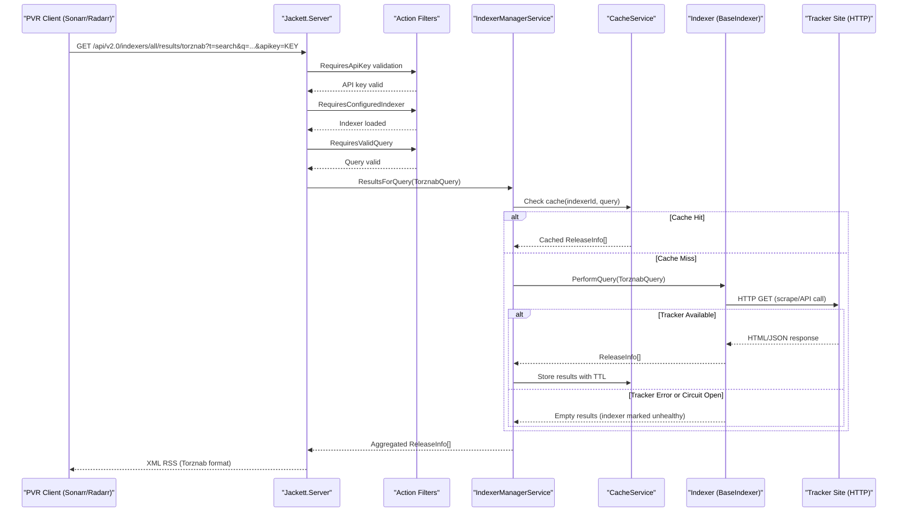

# API & Service Communication Contracts

Jackett exposes a REST API with approximately 20 endpoints across 8 controllers, supporting Torznab (XML/RSS), TorrentPotato (JSON), and a custom JSON management API — all served from a single ASP.NET Core web host.

## Service Catalog

| Service | Port | Category | Purpose |
|---|---|---|---|
| Jackett.Server | Configurable (default 9117) | API Layer | Main ASP.NET Core web server: REST API, web UI, Torznab/RSS search proxy |
| Jackett.Service | N/A | Infrastructure | Windows Service host wrapper for Jackett.Server |
| Jackett.Tray | N/A | Infrastructure | Windows system tray application for controlling Jackett.Server |
| Jackett.Updater | N/A | Infrastructure | Standalone console app for downloading and installing Jackett updates |

## API Endpoints Inventory

| Service | Method | Path | Request Type | Response Type |
|---|---|---|---|---|
| IndexerApiController | GET | /api/v2.0/indexers/ | `configured` (query bool) | `IEnumerable<DTO.Indexer>` (JSON) |
| IndexerApiController | GET | /api/v2.0/indexers/{indexerId}/Config | `indexerId` (route) | JSON config object |
| IndexerApiController | POST | /api/v2.0/indexers/{indexerId}/Config | `DTO.ConfigItem[]` (body) | 204 No Content |
| IndexerApiController | POST | /api/v2.0/indexers/{indexerid}/Test | `indexerid` (route) | 204 No Content |
| IndexerApiController | DELETE | /api/v2.0/indexers/{indexerid} | `indexerid` (route) | 200 OK |
| IndexerApiController | GET | /api/v2.0/indexers/Cache | None | `IReadOnlyList<TrackerCacheResult>` (JSON) |
| ResultsController | GET | /api/v2.0/indexers/{indexerId}/results/ | `ApiSearch` (query: Tracker[], Category[], q, imdbid, tmdbid, tvdbid) | `ManualSearchResult` (JSON) |
| ResultsController | GET | /api/v2.0/indexers/{indexerId}/results/torznab | `TorznabRequest` (query: t, q, cat, imdbid, tvdbid, limit, offset) | XML RSS feed (Torznab) |
| ResultsController | GET | /api/v2.0/indexers/{indexerId}/results/potato | `TorrentPotatoRequest` (query) | `TorrentPotatoResponse` (JSON) |
| ServerConfigurationController | GET | /api/v2.0/server/Config | None | `DTO.ServerConfig` (JSON) |
| ServerConfigurationController | POST | /api/v2.0/server/Config | `DTO.ServerConfig` (body) | Updated config (JSON) |
| ServerConfigurationController | POST | /api/v2.0/server/AdminPassword | `password` (body, string) | 204 No Content |
| ServerConfigurationController | POST | /api/v2.0/server/Update | None | 200 OK |
| ServerConfigurationController | GET | /api/v2.0/server/Logs | None | `List<CachedLog>` (JSON) |
| ServerConfigurationController | POST | /api/v2.0/server/Shutdown | API key required | `{ShuttingDown: true}` (JSON) |
| DownloadController | GET | /dl/{indexerId} | `path`, `jackett_apikey`, `file` (query) | `.torrent` file or magnet redirect |
| BlackholeController | GET | /bh/{indexerId} | `path`, `jackett_apikey`, `file` (query) | `{result, error?}` (JSON) |
| ImageController | GET | /img/{indexerId} | `path`, `jackett_apikey`, `file` (query) | Image binary or status code |
| HealthcheckController | GET | /health | None | `{status: "OK"}` (JSON) |
| HealthcheckController | HEAD | /health | None | 200 OK |
| UIController | GET | /UI/Login | `cookiesChecked` (query) | login.html or redirect |
| UIController | POST | /UI/Dashboard | `password` (form) | Redirect to dashboard |
| UIController | GET | /UI/Dashboard | None | index.html or redirect |
| UIController | GET | /UI/Logout | None | Redirect to login |

> Note: Legacy routes `/torznab/{indexerId}` and `/potato/{indexerId}` are URL-rewritten to the v2.0 API paths via ASP.NET Core URL rewriting middleware.

## Management & Observability Endpoints

| Service | Endpoint | Notes |
|---|---|---|
| Jackett.Server | GET /health | Returns `{status: "OK"}`, no auth required, supports HEAD for uptime probes |
| Jackett.Server | GET /api/v2.0/server/Logs | Returns in-memory NLog cache; requires cookie auth |

> No Swagger/OpenAPI specification, Prometheus metrics endpoint, or distributed tracing instrumentation was found in the codebase.

## DTOs & Contracts

All DTO classes are located in `Jackett.Common/Models/DTO/`:

| DTO Class | API Role | Notes |
|---|---|---|
| `ApiSearch` | Request body/query for manual search | Aggregates Tracker[], Category[], text query, and ID-based search fields (ImdbId, TmdbId, TvdbId, TvMazeId) |
| `ManualSearchResult` | Response for manual search results | Wraps a collection of release results with indexer metadata |
| `TorznabRequest` | Query params for Torznab protocol | Maps `t`, `q`, `cat`, `imdbid`, `tvdbid`, `limit`, `offset` fields |
| `TorrentPotatoRequest` | Query params for Potato protocol | CouchPotato-compatible search request format |
| `TorrentPotatoResponse` | Response for Potato protocol | JSON response with `results` array |
| `TorrentPotatoResponseItem` | Individual result in Potato response | Per-release metadata for Potato clients |
| `Indexer` | Response for indexer list | Indexer metadata: id, name, description, type, configured, site_link, tags, caps |
| `ServerConfig` | Request/response for server configuration | Port, CORS, API key, proxy settings, cache configuration |
| `Config` / `ConfigItem` | Request for indexer configuration update | Key-value configuration items for per-indexer settings |

DTOs are standard C# classes using `Newtonsoft.Json` annotations for serialization. No OpenAPI/Swagger specification, protobuf schemas, or GraphQL schemas were found. No immutable C# records are used for DTOs.

## Communication Patterns

**Synchronous REST**: All API communication is synchronous HTTP/REST. Clients (e.g., Sonarr, Radarr) call Jackett endpoints directly. Jackett in turn makes outbound HTTP calls to tracker sites using `HttpWebClient`/`HttpWebClient2` with Polly-based retry policies.

**Resilience**: Polly 8.6.6 provides retry and circuit-breaker policies for outbound HTTP calls to tracker sites. Indexers track health status internally: an indexer in error state is marked unhealthy with a 10-minute backoff, and the cache serves stale results during the backoff window. Specific timeout values are configurable per-request via `WebRequest.EolDefinition`.

**Protocol Aggregation**: The `all` meta-indexer aggregates responses from all configured indexers in parallel and merges them into a single Torznab/Potato/JSON response. Individual indexer failures do not fail the aggregate response — they are silently skipped.

**URL Rewriting**: Legacy `/torznab/{id}` and `/potato/{id}` route patterns are transparently rewritten to `/api/v2.0/indexers/{id}/results/torznab` and `/api/v2.0/indexers/{id}/results/potato` via ASP.NET Core `UseRewriter()` middleware.

**No message broker or asynchronous messaging** is used. No service discovery (Consul, Eureka, Kubernetes DNS) is configured — Jackett operates as a single-instance application.

**Security posture**: Authentication uses ASP.NET Core cookie authentication (cookie name: `Jackett`, 14-day expiration). API endpoints accessed by PVR clients are protected by an API key validated via `RequiresApiKey` action filter (`apikey` or `passkey` query parameter). An optional admin password can be configured for the web UI. **HTTPS/TLS is not enforced by default** — Jackett listens on plain HTTP unless an SSL reverse proxy is configured externally. CORS is disabled by default but can be enabled via `AllowCORS` server configuration. Forwarded header middleware trusts private network ranges (`10.0.0.0/8`, `172.16.0.0/12`, `192.168.0.0/16`).

## Service Technology Matrix

| Service | Web Framework | Data Access | Discovery | Gateway | Health Check | Cache | Metrics |
|---|---|---|---|---|---|---|---|
| Jackett.Server | ASP.NET Core MVC (net9.0) | File-based JSON / In-memory | None | Torznab/Potato aggregation | GET /health | In-memory (CacheService) | None |
| Jackett.Service | None (wrapper) | None | None | None | None | None | None |
| Jackett.Tray | WinForms | None | None | None | None | None | None |
| Jackett.Updater | Console app | None | None | None | None | None | None |

## Service Communication Sequence

