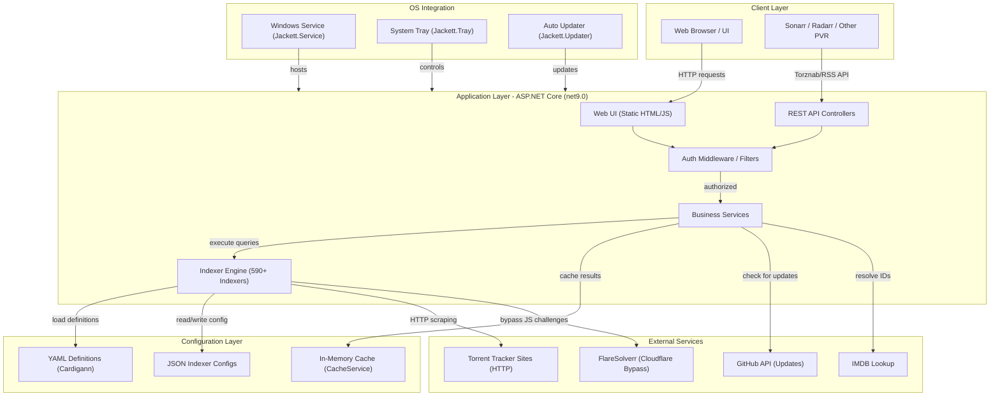
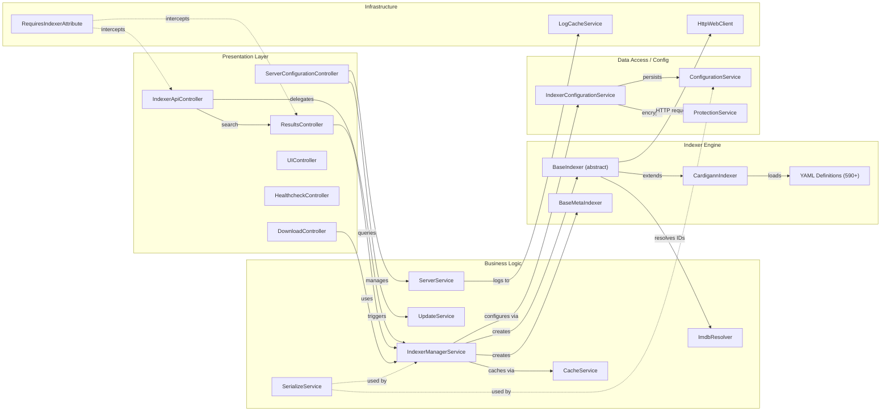

# Architecture Diagram

Jackett is a .NET-based torrent meta-search proxy that aggregates results from 590+ tracker sites through a unified Torznab/RSS API. It exposes an ASP.NET Core web server with a REST API and web UI, backed by file-based configuration and in-memory caching.

## Application Architecture

### Technology Stack Summary

| Layer | Technology | Version | Purpose |
|---|---|---|---|
| Web Framework | ASP.NET Core | net9.0 | REST API and static web UI hosting |
| Dependency Injection | Autofac | 8.0.0 | IoC container with module-based registration |
| HTML Parsing | AngleSharp | 1.4.0 | Scraping torrent tracker web pages |
| HTTP Client | System.Net.Http / HttpWebClient | .NET built-in | HTTP requests to trackers with proxy support |
| JSON Serialization | Newtonsoft.Json | 13.0.4 | API responses and configuration serialization |
| YAML Parsing | YamlDotNet | 16.3.0 | Loading Cardigann indexer definitions |
| Logging | NLog + NLog.Web.AspNetCore | 5.5.1 | Structured application logging |
| Resilience | Polly | 8.6.6 | Retry policies for HTTP requests |
| Cloudflare Bypass | FlareSolverrSharp | 3.0.7 | Bypassing JS challenges on tracker sites |
| Compression | SharpZipLib | 1.4.2 | ZIP/archive handling |
| OS Integration | Mono.Posix / ServiceProcess | 7.1.0 | Linux/Windows service support |

### Data Storage & External Services

Jackett uses **no relational database**. All persistent state is stored as JSON files in the application data folder (`[AppDataFolder]/Indexers/*.json` for per-indexer configuration, and a global `ServerConfig` JSON). Over 590 tracker definitions are stored as YAML files in the `Definitions/` directory and loaded at startup by the Cardigann engine. An **in-memory dictionary cache** (`CacheService`) stores search results per indexer per query with configurable TTL to prevent redundant HTTP requests. External services include 590+ torrent tracker websites (accessed via HTTP scraping), FlareSolverr for Cloudflare bypass, the GitHub Releases API for auto-updates, and optional IMDB ID resolution.

### Key Architectural Decisions

- **Plugin-based Cardigann engine**: Indexers are defined as YAML configuration files (590+) that are dynamically loaded and interpreted at runtime, allowing new trackers to be added without code changes.
- **Torznab API aggregation**: Jackett translates tracker-specific search results into the standardized Torznab XML/RSS format, acting as a universal proxy for PVR clients like Sonarr and Radarr.
- **Autofac DI with module registration**: All services, indexers, and HTTP clients are registered through `JackettModule`, enabling clean dependency injection and testability.

## Component Relationships

### Component Inventory

| Component | Layer | Type | Responsibility |
|---|---|---|---|
| IndexerApiController | Presentation | ASP.NET Core Controller | CRUD for indexer configs, search execution, health checks |
| ServerConfigurationController | Presentation | ASP.NET Core Controller | Server settings, update management, log retrieval |
| ResultsController | Presentation | ASP.NET Core Controller | Torznab/RSS search result aggregation endpoint |
| DownloadController | Presentation | ASP.NET Core Controller | Torrent download proxying |
| UIController | Presentation | ASP.NET Core Controller | Serves the single-page web UI |
| HealthcheckController | Presentation | ASP.NET Core Controller | Liveness/readiness health endpoint |
| IndexerManagerService | Business Logic | Singleton Service | Loads, manages lifecycle, and routes queries to indexers |
| CacheService | Business Logic | Singleton Service | In-memory TTL cache for search results per indexer/query |
| UpdateService | Business Logic | Singleton Service | Checks GitHub for new releases and triggers updates |
| ServerService | Business Logic | Singleton Service | Provides server metadata, version, and state management |
| ImdbResolver | Business Logic | Singleton Service | Resolves IMDB IDs to titles and metadata |
| BaseIndexer | Indexer Engine | Abstract Base Class | Common indexer logic: config, cookies, error tracking, caching |
| CardigannIndexer | Indexer Engine | Derived Class | Interprets YAML definitions to drive scraping logic |
| BaseMetaIndexer | Indexer Engine | Abstract Base Class | Aggregates results from multiple child indexers |
| YAML Definitions | Indexer Engine | Configuration | 590+ tracker site definitions for Cardigann |
| ConfigurationService | Data Access | Singleton Service | File I/O for JSON configs in AppData folder |
| IndexerConfigurationService | Data Access | Singleton Service | Per-indexer config read/write with migration support |
| ProtectionService | Data Access | Singleton Service | DPAPI-based encryption for sensitive config fields |
| RequiresIndexerAttribute | Infrastructure | Action Filter | Loads and validates indexer from route parameter |
| HttpWebClient | Infrastructure | HTTP Client | Outbound HTTP requests with proxy and cookie support |
| LogCacheService | Infrastructure | Singleton Service | Circular in-memory log buffer for UI log viewer |
