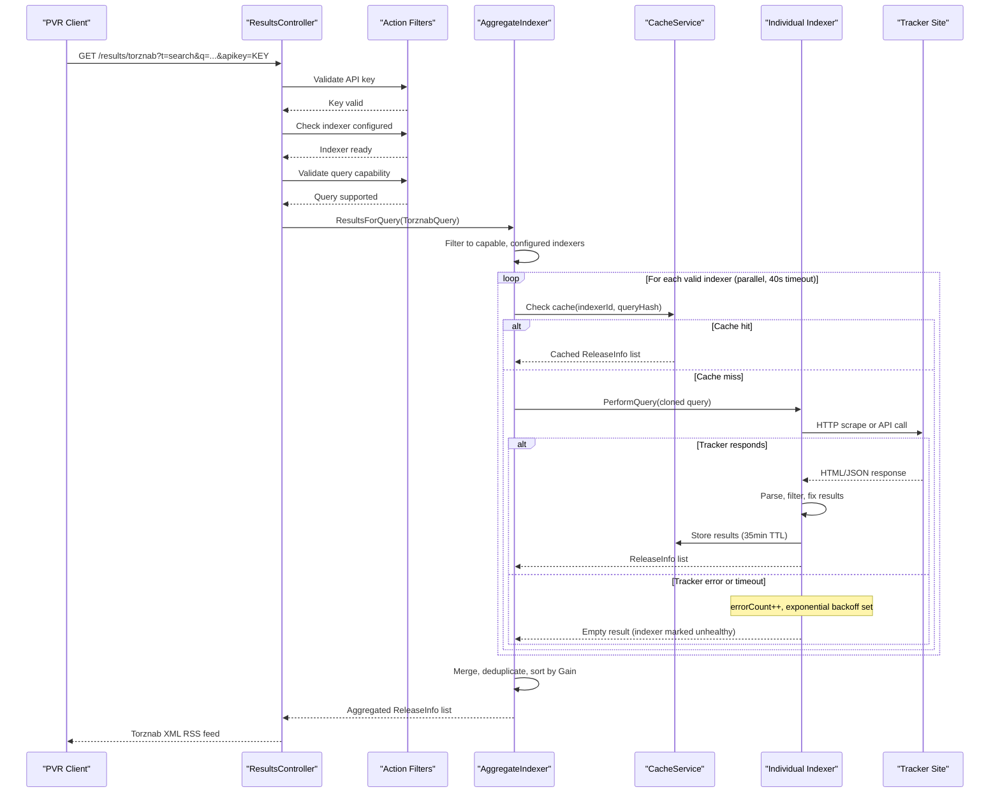

# Core Business Workflows

Jackett is a torrent meta-search proxy that lets users and PVR clients (Sonarr, Radarr) search across hundreds of private and public torrent tracker sites simultaneously through a single, standardized Torznab/RSS API.

## Domain Entities

| Entity | Service / Bounded Context | Description | Key Relationships |
|---|---|---|---|
| Indexer | Indexer Management | Represents a single torrent tracker site or meta-aggregator; tracks health, configuration, and capabilities | Owns ConfigurationData; participates in MetaIndexer aggregation |
| ConfigurationData | Indexer Configuration | Per-indexer settings (login credentials, site link, cookies, API keys); polymorphic based on auth type | Owned by one Indexer; protected by IProtectionService |
| ReleaseInfo | Search Results | A single torrent release returned by an indexer; carries all metadata (title, size, seeders, media IDs) | Associated with a source Indexer; cached in TrackerCacheQuery |
| TorznabQuery | Search / Query | Represents a search request with type (TV, Movie, Music, Book), text query, ID-based lookups, and pagination | Used to query Indexers; key into CacheService lookup |
| TorznabCapabilities | Indexer Capabilities | Describes what search types and categories an indexer supports | Owned by one Indexer; used to filter valid queries |
| TrackerCache | Caching | In-memory cache bucket per indexer | Contains multiple TrackerCacheQuery entries |
| ServerConfig | Server Configuration | Global server settings (port, auth, proxy, cache) | Referenced by CacheService, all services |
| CachedLog | Observability | Recent log entries held in memory for the UI log viewer | Owned by LogCacheService |

## Service-to-Domain Mapping

| Service | Domain Context | Owned Entities | External Dependencies |
|---|---|---|---|
| Jackett.Common / IndexerManagerService | Indexer Lifecycle | Indexer, ConfigurationData, TorznabCapabilities | File system (config JSON), YAML definitions folder |
| Jackett.Common / CacheService | Search Result Caching | TrackerCache, TrackerCacheQuery, ReleaseInfo (cached) | ServerConfig for TTL/size settings |
| Jackett.Common / UpdateService | Auto-Update | None (process management) | GitHub Releases API |
| Jackett.Server / ResultsController | Search Execution | TorznabQuery, ReleaseInfo (transient) | IndexerManagerService, CacheService |
| Jackett.Server / IndexerApiController | Indexer Configuration | ConfigurationData | IndexerManagerService, CacheService |
| Jackett.Server / ServerConfigurationController | Server Management | ServerConfig | ConfigurationService, UpdateService |

## Primary Workflows

### Workflow 1: Torrent Search (Core Business Flow)

A PVR client (or user via the web UI) sends a search query. Jackett routes it to one or more indexers, aggregates results, caches them, and returns a unified response.

**Steps:**
1. Client submits a search request to `/api/v2.0/indexers/{indexerId}/results/torznab` (or `/results/` for JSON).
2. **RequiresApiKey** filter validates `apikey` or `passkey` query parameter.
3. **RequiresConfiguredIndexer** filter verifies the indexer exists, is supported on the current platform, and `IsConfigured = true`.
4. **RequiresValidQuery** filter parses the query and checks `CanHandleQuery()` — returns 400 if the query type is unsupported by the indexer.
5. If `indexerId == "all"`, **AggregateIndexer** fans out to all configured, capable indexers in parallel (40-second timeout).
6. Per indexer: `BaseIndexer.ResultsForQuery()` clones the query, checks the in-memory cache (cache hit returns immediately), and if a miss, calls `PerformQuery()`.
7. Results are filtered by category, de-duplicated by GUID, and fixed (magnet generation, publish date capping, infohash extraction).
8. Results are cached under a SHA256-hashed query key with a 35-minute TTL.
9. Aggregated results are sorted by `Gain` (seeders × size) and returned as Torznab XML RSS, TorrentPotato JSON, or plain JSON.

### Workflow 2: Indexer Configuration

A user configures a new tracker site so Jackett can search it.

**Steps:**
1. User opens the web UI dashboard and selects an unconfigured indexer.
2. `GET /api/v2.0/indexers/{indexerId}/Config` returns the indexer's `ConfigurationData` (login fields, site link, etc.).
3. User fills in credentials and submits via `POST /api/v2.0/indexers/{indexerId}/Config`.
4. The existing cache for the indexer is cleared (`CacheService.CleanIndexerCache`).
5. `ApplyConfiguration()` is called on the indexer: credentials are encrypted via `IProtectionService` and persisted to `{AppDataFolder}/Indexers/{id}.json`.
6. If the result is `RequiresTesting`, the indexer is auto-tested immediately by running a query against the live tracker site.
7. On test failure, `LastError` is set and the indexer's health is marked as failing; the user sees the error in the UI.
8. On success, `IsConfigured = true`, `errorCount = 0`, and the indexer becomes available for searches.

### Workflow 3: Indexer Health and Error Recovery

Jackett tracks indexer health automatically and applies exponential backoff on failures.

**Steps:**
1. Every `ResultsForQuery()` call wraps `PerformQuery()` in a try-catch.
2. On success: `errorCount` is reset to 0, `expireAt` is set to `NOW + (CacheTTL × 2)`.
3. On `TooManyRequestsException` (HTTP 429): `expireAt` is set to `NOW + RetryAfter` from the response header.
4. On any other exception: `expireAt = NOW + Min(MaxValidity=1day, ErrorValidity(10min) × 2^errorCount++)`. The delay grows exponentially with each failure.
5. While an indexer is in failing state (`IsFailing = true`), aggregate searches skip it, protecting overall search latency.
6. After `expireAt` passes, the indexer is considered expired and the next search will retry it.

### Workflow 4: Automatic Update

Jackett checks GitHub for new releases every 24 hours (1 hour on first start) and self-updates.

**Steps:**
1. Background `UpdateWorkerThread` wakes after a configurable interval.
2. Skips check if: `RuntimeSettings.NoUpdates = true`, `ServerConfig.UpdateDisabled = true`, a debugger is attached, or the running version is `0.0.0` (developer mode).
3. Fetches releases from the GitHub Releases API; optionally includes pre-releases if `UpdatePrerelease = true`.
4. Compares `latestVersion` to current version using semantic versioning. Logs a warning if the installed version is newer than GitHub (manual install scenario).
5. Downloads the matching release asset for the current platform variant (Windows, Linux, macOS, Mono).
6. Extracts the archive, fixes file permissions on Unix, then spawns `JackettUpdater` process.
7. Updater receives current install path, app type (Console or WindowsService), and a restart flag.
8. A `.lock` file is created before the update; if Jackett starts and finds this file, it logs a previous update failure and deletes the lock.

### Workflow 5: Indexer Initialization at Startup

All indexers are loaded and configured before the server accepts requests.

**Steps:**
1. `InitIndexers()` uses reflection to discover all `IIndexer` implementations in the assembly; instantiates each with Autofac.
2. `InitCardigannIndexers()` scans the `Definitions/` folder (and any custom Cardigann folders) for YAML files; instantiates a `CardigannIndexer` per definition. Renamed indexer IDs are migrated to their new names.
3. `InitIndexersConfiguration()` loads each indexer's saved JSON config file; indexers with valid saved config are marked `IsConfigured = true`.
4. `InitMetaIndexers()` creates the `AggregateIndexer` (id: `"all"`) and tag/type-based `FilterIndexer` instances. These are not individually configurable.
5. Server is now ready to accept search requests.

## Cross-Service Data Flows

Jackett is a single-process application, so there are no cross-network service calls between internal components. The primary external data flow is the **fan-out aggregation pattern** in `BaseMetaIndexer`:

When a search targets the `"all"` meta-indexer, it:
1. Filters the full indexer list to those that are `IsConfigured`, pass `FilterFunc` (tag/type filter), and return `true` from `CanHandleQuery()`.
2. Launches all qualifying indexers as parallel `Task`s.
3. Waits up to **40 seconds** for all tasks to complete. Indexers that time out are silently dropped from results.
4. Merges all `ReleaseInfo` collections with `SelectMany`, applies result filters (e.g., IMDB title matching), deduplicates on GUID, sorts by `Gain` descending, and takes up to the requested `Limit`.
5. **Fallback behavior**: If an indexer throws any exception (including timeout), it is marked unhealthy and its partial or empty result set is simply excluded from the merged response — no error is surfaced to the client. The aggregate result continues with fewer sources.
6. **IMDB fallback strategy**: If a query includes an IMDB ID but an indexer does not support IMDB-based searches, `ImdbResolver` attempts to resolve the IMDB ID to a title and reruns the query as a text search. This maximizes cross-indexer coverage.

## Business Workflow Sequence

## Business Rules & Decision Logic

### Validation Rules

| Rule | Where Applied | Behavior on Violation |
|---|---|---|
| API key must match `ServerConfig.APIKey` | `RequiresApiKey` filter | HTTP 401 Unauthorized |
| Indexer must exist and be configured | `RequiresConfiguredIndexer` filter | HTTP 404 / 400 |
| Query type must match indexer capabilities | `RequiresValidQuery` / `CanHandleQuery()` | HTTP 400 / query skipped |
| IMDB ID must be parseable (7-8 digit format) | `ParseUtil.GetFullImdbId()` in `Torznab()` | HTTP 400 with error XML |
| Indexer site link must end with "/" | `LoadValuesFromJson()` in BaseIndexer | Site link auto-corrected |
| Indexer site link must be valid URI | `LoadValuesFromJson()` in BaseIndexer | Configuration rejected |
| Release title must be non-empty | `IsValidRelease()` in BaseMetaIndexer | Release dropped (error logged) |
| Release size required for non-interactive | `IsValidRelease()` in BaseMetaIndexer | Release dropped |
| Release categories required for non-interactive | `IsValidRelease()` in BaseMetaIndexer | Release dropped |

### Decision Logic

| Decision | Logic | Outcome |
|---|---|---|
| IMDB fallback search | Indexer lacks IMDB support → `ImdbResolver` resolves ID to title → retry as text search | Maximizes cross-indexer result coverage |
| Interactive search leniency | `interactiveSearch=true` (UI search) → skip size/category validation | UI users see more results than PVR clients |
| Result deduplication | GUID collision → keep first occurrence | Prevents duplicates in merged aggregate |
| Result ranking | Sort by `Gain = Seeders × GigabytesFromBytes(Size)` | Higher-quality, better-seeded releases ranked first |
| Meta-indexer timeout | 40 seconds across all parallel indexer queries | Protects PVR clients from long waits |
| Indexer backoff cap | `Min(MaxValidity=24h, ErrorValidity(10min) × 2^errorCount)` | Failing indexers retry at most once per day |

### State Transitions

**Indexer Health States:**
- `Healthy` → `Failing`: Any exception in `PerformQuery()` increments `errorCount` and sets `expireAt` with exponential delay
- `Failing` → `Healthy`: Successful `PerformQuery()` resets `errorCount = 0` and sets `expireAt = NOW + HealthyStatusValidity`
- Any state → `Expired`: `expireAt` timestamp passes; next search attempt retries regardless of `errorCount`
- `Unconfigured` → `Configured`: `ApplyConfiguration()` succeeds; `IsConfigured = true` persisted to JSON

**Update States:**
- `Checking` → `UpToDate`: Latest GitHub release version ≤ current version
- `Checking` → `Downloading`: New version found
- `Downloading` → `Applying`: Asset downloaded successfully
- `Applying` → `Restarting`: Updater process launched; Jackett exits with code 0

### Cross-Cutting Concerns

- **No distributed transactions**: All operations are in-process; there is no saga or compensating transaction logic.
- **Error isolation**: Per-indexer failures in aggregate searches are silently swallowed to maintain partial results availability. Errors are logged and surfaced in the web UI log viewer.
- **Audit logging**: NLog logs all search queries with performance metrics (duration, cache hit/miss, result count) at INFO level.
- **Authorization**: Cookie-based admin auth guards the web UI. API key guards programmatic access. There is no RBAC — all authenticated users have full access.
- **Query cloning**: `TorznabQuery` is cloned before passing to each indexer to prevent cross-indexer state mutation.
