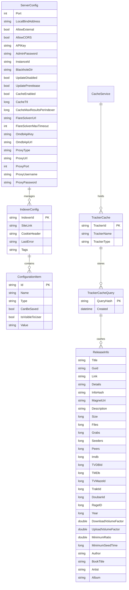

# Data Architecture & Persistence Layer

Jackett uses no relational database or ORM framework — all persistent state is stored as JSON files on the local filesystem, with an in-memory dictionary cache for search results and no schema migration tooling.

## Database Configuration

| Service/Module | DB Type | Profile | Driver | Connection | Migration Tool |
|---|---|---|---|---|---|
| Jackett.Common | File system (JSON) | All | None (file I/O) | `{AppDataFolder}/*.json` | None (manual migration code in ConfigurationService) |
| Jackett.Common | In-memory dictionary | All | None | Process memory | N/A |
| Jackett.Server | File system (JSON) | All | None (file I/O) | `{AppDataFolder}/Indexers/*.json` | None |

> No relational or document database engine is used. There are no connection strings, connection pools, or migration scripts. Schema evolution is handled by hand-written migration methods in `ConfigurationService.CreateOrMigrateSettings()`.

## Data Ownership per Service

| Service | Entities Owned | ORM Framework | Caching | Notes |
|---|---|---|---|---|
| Jackett.Common | ServerConfig, IndexerConfig (per indexer), ReleaseInfo (in cache) | None (custom file serialization via SerializeService) | In-memory CacheService (Dictionary-based) | Per-indexer configs stored as `{AppDataFolder}/Indexers/{indexerId}.json` |
| Jackett.Server | No owned entities; reads ServerConfig via ConfigurationService | None | None | Delegates all persistence to Jackett.Common services |
| Jackett.Service | None | None | None | Windows Service wrapper only |
| Jackett.Tray | None | None | None | System tray UI wrapper only |
| Jackett.Updater | None | None | None | Update download logic only |

## Entity Model

## Key Repository Methods

| Service | Class | Notable Methods | Purpose |
|---|---|---|---|
| Jackett.Common | `ConfigurationService` | `GetConfig<T>()` | Deserialize `{AppDataFolder}/{T.Name}.json` into a typed config object |
| Jackett.Common | `ConfigurationService` | `SaveConfig<T>(T config)` | Serialize config object to `{AppDataFolder}/{T.Name}.json` |
| Jackett.Common | `ConfigurationService` | `GetIndexerConfigDir()` | Returns path to `{AppDataFolder}/Indexers/` directory |
| Jackett.Common | `ConfigurationService` | `BuildServerConfig(RuntimeSettings)` | Load or initialize `ServerConfig` with defaults and apply CLI overrides |
| Jackett.Common | `ConfigurationService` | `CreateOrMigrateSettings()` | Migrate settings from legacy config paths (OSX, Windows) |
| Jackett.Common | `IndexerConfigurationService` | `LoadIndexerConfig(IIndexer indexer)` | Load per-indexer JSON config and decrypt sensitive fields via IProtectionService |
| Jackett.Common | `IndexerConfigurationService` | `SaveIndexerConfig(IIndexer indexer, ConfigurationData config)` | Serialize and encrypt indexer config to JSON file |
| Jackett.Common | `CacheService` | `CacheResults(IIndexer, TorznabQuery, List<ReleaseInfo>)` | Store search results keyed by SHA256-hashed query; apply TTL and max-results pruning |
| Jackett.Common | `CacheService` | `Search(IIndexer, TorznabQuery)` | Return cached results for a query if within TTL; null on cache miss |
| Jackett.Common | `CacheService` | `GetCachedResults()` | Return up to 3,000 recent results (max 300 per indexer) for UI display |
| Jackett.Common | `CacheService` | `CleanIndexerCache(IIndexer)` | Evict all cached entries for a specific indexer |

## Caching Strategy

| Aspect | Details |
|---|---|
| Cache Provider | Custom in-memory `CacheService` backed by `Dictionary<string, TrackerCache>` |
| Scope | Single process / single instance — no distributed caching |
| Cache Key | SHA256 hash of the serialized `TorznabQuery` object, scoped per indexer ID |
| TTL | Configurable via `ServerConfig.CacheTtl` (default **2,100 seconds / 35 minutes**) |
| Max Results per Indexer | Configurable via `ServerConfig.CacheMaxResultsPerIndexer` (default **1,000 releases**) |
| Global Display Cap | `GetCachedResults()` returns at most **3,000 entries**, capped at **300 per indexer** |
| Eviction Patterns | TTL-based (`PruneCacheByTtl`) and size-based (`PruneCacheByMaxResultsPerIndexer`) — oldest queries dropped first |
| Cache Exclusions | Test queries (`TorznabQuery.IsTest == true`) are never cached |
| Thread Safety | `lock(_cache)` on the cache dictionary for all read/write operations |
| Cache Invalidation | `CleanIndexerCache(indexer)` called when an indexer is reconfigured or deleted |

**Rationale**: Search queries to external tracker sites involve outbound HTTP scraping that is slow (1–30 seconds) and subject to rate limiting. Caching prevents redundant requests within the TTL window, especially important for PVR clients that poll frequently.

## Data Ownership Boundaries

Jackett is a **single-instance application** with no microservice boundaries. All persistent data is owned by `Jackett.Common` services and stored in a single application data folder on the local filesystem. There is no shared database, no database-per-service isolation, and no cross-service data access — all modules within the solution access configuration through the `IConfigurationService` interface.

The data flow is write-light / read-heavy: indexer configurations are written once during setup and read on every search request. The in-memory cache is the primary hot path for repeated queries. There is no CQRS pattern, event sourcing, or outbox table.

The `IProtectionService` implementation uses DPAPI (Windows) or custom encryption to protect sensitive configuration fields (passwords, API keys, cookies) at rest in JSON files. Runtime-only settings (command-line arguments via `RuntimeSettings`) are never persisted.

### Data Classification & Sensitivity

| Entity | Sensitive Fields | Classification | Controls in Place |
|---|---|---|---|
| ServerConfig | `AdminPassword` (hashed), `APIKey`, `ProxyUsername`, `ProxyPassword`, `OmdbApiKey` | Confidential / Credentials | AdminPassword stored as bcrypt hash; APIKey is a random GUID; Proxy credentials stored in plaintext in JSON file |
| IndexerConfig | `CookieHeader` (session cookies), per-indexer passwords, API keys | Confidential / Credentials | Encrypted at rest via `IProtectionService` (DPAPI on Windows); decrypted in memory only |
| ReleaseInfo (cache) | None — torrent metadata only (titles, sizes, seeders) | Public | N/A |
| ServerConfig (sonarr_api.json) | Sonarr API key | Confidential / Credentials | Stored in plaintext JSON file |

> **Risk**: Proxy credentials (`ProxyUsername`, `ProxyPassword`) and the Sonarr API key are stored in plaintext JSON files without encryption. The `IProtectionService` encryption is only applied to indexer-specific configurations, not to the main `ServerConfig.json`. An attacker with filesystem access to the application data folder can read these values directly.
