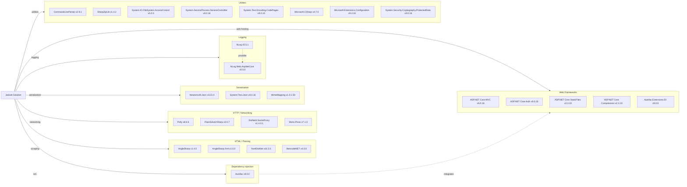

# Dependency Map

Jackett is a multi-project .NET solution (8 projects) with approximately 35 unique external NuGet package dependencies spanning web frameworks, HTTP/scraping utilities, serialization, logging, and OS integration layers.

## Dependencies

### Dependency Summary

| Category | Count | Key Libraries | Notes |
|---|---|---|---|
| Web Frameworks | 5 | ASP.NET Core MVC 9.0.16, ASP.NET Core Auth 9.0.16 | Dual-targets net9.0 and net471; net471 uses older 2.3.x ASP.NET Core packages |
| HTML / Parsing | 4 | AngleSharp 1.4.0, YamlDotNet 16.3.0, BencodeNET 4.0.0 | AngleSharp used for HTML scraping; YamlDotNet for 590+ Cardigann tracker definitions |
| HTTP / Networking | 4 | Polly 8.6.6, FlareSolverrSharp 3.0.7, DotNet4.SocksProxy 1.4.0.1 | Polly provides resilience; FlareSolverr bypasses Cloudflare; SOCKS proxy for anonymity |
| Serialization | 3 | Newtonsoft.Json 13.0.4, System.Text.Json 9.0.16 | Both JSON libraries present simultaneously |
| Logging | 2 | NLog 5.5.1, NLog.Web.AspNetCore 5.5.0 | NLog with ASP.NET Core integration |
| Dependency Injection | 1 | Autofac 8.0.0 | Module-based DI container |
| Utilities | 8 | CommandLineParser 2.9.1, SharpZipLib 1.4.2, Mono.Posix 7.1.0 | Cross-platform utilities for CLI, compression, and OS integration |

### Version & Compatibility Risks

The solution targets both **net9.0** (current) and **net471** (.NET Framework 4.7.1, which is in maintenance mode as of 2022). The net471 target uses older `Microsoft.AspNetCore` 2.3.x packages that are end-of-life. **`Microsoft.CSharp` 4.7.0** is an older package that may not be necessary on modern .NET. **`DotNet4.SocksProxy` 1.4.0.1** is an older, low-activity library with limited .NET Core support. **`Selenium.Chrome.WebDriver` 85.0.0** in the integration test project is extremely outdated (Chrome 85, released 2020) and incompatible with modern Chrome browser versions. **`FlareSolverrSharp` 3.0.7** is an unofficial Cloudflare bypass library that may break with Cloudflare updates. The coexistence of both `Newtonsoft.Json` and `System.Text.Json` adds serialization complexity.

### Notable Observations

- **Dual JSON libraries**: Both `Newtonsoft.Json` (13.0.4) and `System.Text.Json` (9.0.16) are referenced, creating potential inconsistency in serialization behavior. Consolidating to `System.Text.Json` is recommended for .NET 9+ projects.
- **Legacy .NET Framework 4.7.1 support**: Multiple projects target both `net9.0` and `net471`, requiring conditional package references and increasing maintenance burden. The net471 target has end-of-life ASP.NET Core 2.3.x dependencies.
- **Very outdated Selenium Chrome WebDriver**: `Selenium.Chrome.WebDriver` 85.0.0 (2020) in `Jackett.IntegrationTests` is incompatible with any modern Chrome installation, likely causing integration test failures.
- **Third-party Cloudflare bypass**: `FlareSolverrSharp` introduces a runtime dependency on a running FlareSolverr server, which is an external, uncontrolled service that may become unavailable or break with Cloudflare protocol changes.

## Test Dependencies

| Framework | Version | Notes |
|---|---|---|
| Microsoft.NET.Test.Sdk | 17.14.1 | Test platform infrastructure |
| MSTest.TestAdapter | 3.10.4 | MSTest runner adapter |
| MSTest.TestFramework | 3.10.4 | MSTest assertion framework |
| NUnit | 3.14.0 | Unit test framework (primary) |
| NUnit.ConsoleRunner | 3.17.0 | NUnit console runner |
| NUnit3TestAdapter | 4.5.0 | NUnit adapter for dotnet test |
| FluentAssertions | 6.12.1 | Fluent assertion library |
| coverlet.msbuild | 6.0.4 | Code coverage instrumentation |
| Selenium.WebDriver | 4.35.0 | Browser automation (integration tests) |
| Selenium.Chrome.WebDriver | 85.0.0 | ChromeDriver binary (integration tests) |
| Microsoft.AspNetCore.DataProtection | 9.0.16 | Used in test setup for encryption |

Total test-scope dependencies: 11

The project uses **two test frameworks simultaneously** (NUnit and MSTest), which adds complexity to test configuration and runner setup. The `Selenium.Chrome.WebDriver` 85.0.0 package is critically outdated and will not work with modern Chrome browser versions, making the integration test suite effectively non-functional unless manually overridden with a current ChromeDriver binary.
